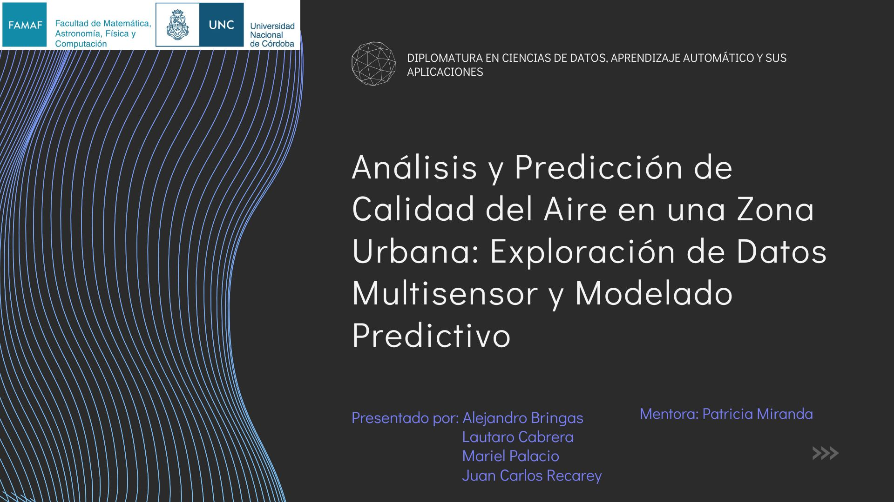

# 🌍🌎🌏 Air Quality Analysis and Prediction in an Urban Area

### Diploma in Data Science, Machine Learning, and its Applications

### Projects #1, #2, and #3: Data Exploration, Cleaning, and Predictive Modeling

---
## 🎥 Presentation Video

]

---

## 📌 General Project Overview

Air quality is a critical global public health issue. According to the World Health Organization (WHO, 2018), air pollution causes 1 in every 9 deaths worldwide. Despite its importance, many regions still lack comprehensive air quality data to develop effective mitigation strategies.

These projects analyze data collected from a multisensor gas device installed in a heavily polluted urban area in Italy. The dataset records hourly average gas concentrations and sensor responses over a 13-month period (March 2004 – April 2005). The overall aim is to explore, clean, model, and predict pollutant concentrations to better understand environmental influences and support decision-making for air quality improvement.

---

## 📊 Dataset Description

* **Source:** [UCI Machine Learning Repository – Air Quality Dataset](https://archive.ics.uci.edu/dataset/360/air+quality)
* **Rows:** 9,471 hourly observations
* **Columns:** 17 variables, including gas concentrations and sensor readings
* **Period:** March 2004 to April 2005
* **Sensors:** Metal oxide chemical sensors (PT08.S1 to PT08.S5) targeting pollutants such as CO, NMHC, NOx, NO2, O3
* **Missing Data:** Encoded as `-200`

Dataset used in these projects can be downloaded here:
[GitHub - AirQualityUCI.csv](https://github.com/PatriMiranda/Calidad-de-Aire/blob/main/AirQualityUCI.csv)

---

## 🔍 Project #1 – Data Analysis and Visualization

* Explored pollutant concentration trends and sensor responses.
* Identified data quality issues such as missing values and anomalies.
* Visualized pollutant interactions and environmental factors to uncover initial insights.

---

## 🧹 Project #2 – Exploratory Data Analysis and Data Cleaning

* Conducted detailed correlation analyses between sensors, pollutants, and environmental variables.
* Found that sensors do not always correlate exclusively with their target pollutants, indicating possible calibration issues or sensor cross-sensitivity.
* Examined the relationship between temperature, humidity, and pollutant levels, noting generally low but relevant correlations.
* Prepared the dataset for modeling by considering strategies for handling missing data, outliers, and feature engineering.

---

## 🤖 Project #3 – Supervised Learning for Prediction

* Applied machine learning models (including decision trees, Random Forest, XGBoost, LightGBM, regression models) to predict pollutant concentrations based on sensor and environmental data.
* Evaluated models using metrics such as R², MAE, and RMSE.
* Identified LightGBM and XGBoost as best-performing models for different pollutants (CO, C6H6, NO2, NOx).
* Found that environmental variables have a smaller influence on pollutant levels compared to human activities (e.g., traffic, industry).
* Noted overfitting tendencies suggesting the need for more data and domain expertise for model refinement.

### Best Model Performance Summary

| Pollutant | Best Model       | R²     | MAE    | RMSE   |
| --------- | ---------------- | ------ | ------ | ------ |
| CO        | LightGBM (Hyper) | 0.9629 | 0.1197 | 0.1847 |
| C6H6      | XGBoost (Hyper)  | 0.9876 | 0.0747 | 0.1084 |
| NO2       | LightGBM (Hyper) | 0.9455 | 0.1544 | 0.2260 |
| NOx       | LightGBM (Hyper) | 0.9624 | 0.1134 | 0.1821 |

---

## 🎯 Key Research Questions Addressed

1. How accurately can pollutant concentrations be predicted using environmental and sensor data?
2. What are the main factors influencing pollution levels in the urban area?
3. Are the sensors reliable for specific pollutant detection, or is recalibration needed?
4. What environmental conditions tend to precede spikes in pollutant concentrations?
5. Can unsupervised learning techniques reveal hidden patterns in the data?

---

## 📚 Conclusion and Future Work

This combined study provides a comprehensive approach to air quality assessment through data science. The results highlight the complexity of sensor data and environmental influences, the need for careful data preprocessing, and the potential of advanced machine learning models to support environmental health decision-making.

Future directions include:

* Improving sensor calibration and validation.
* Expanding datasets with external variables (traffic, weather forecasts).
* Deploying real-time prediction systems for urban air quality management.
* Engaging domain experts to enhance model interpretability and actionability.

